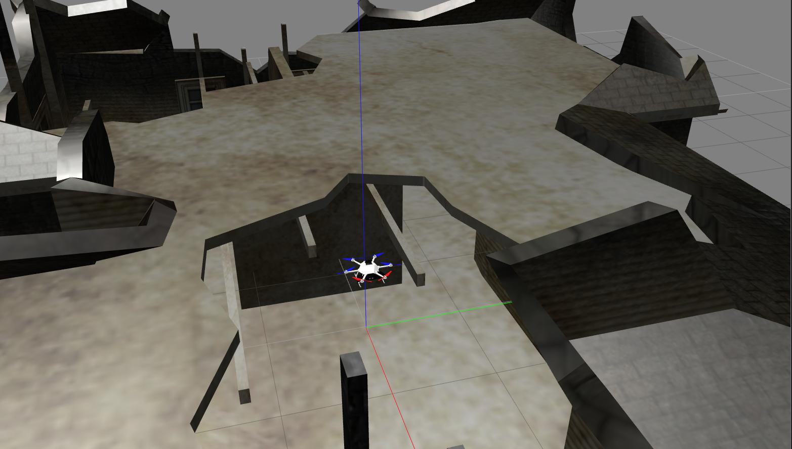
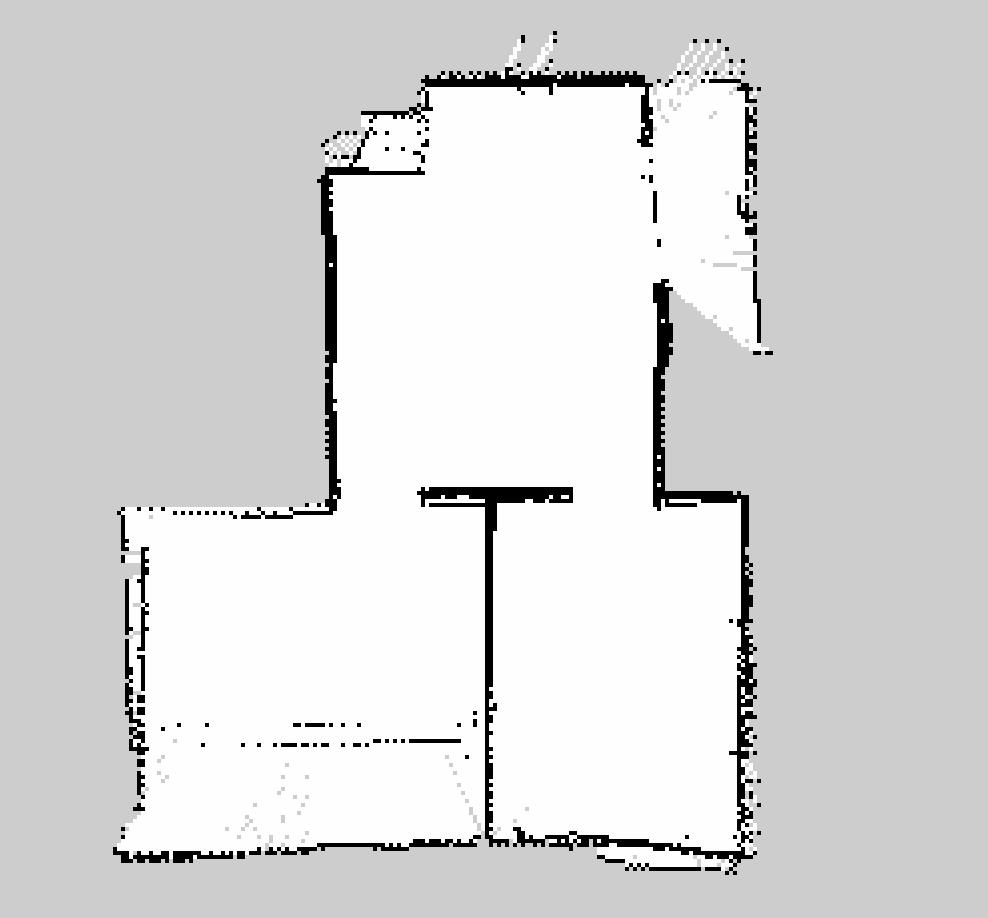
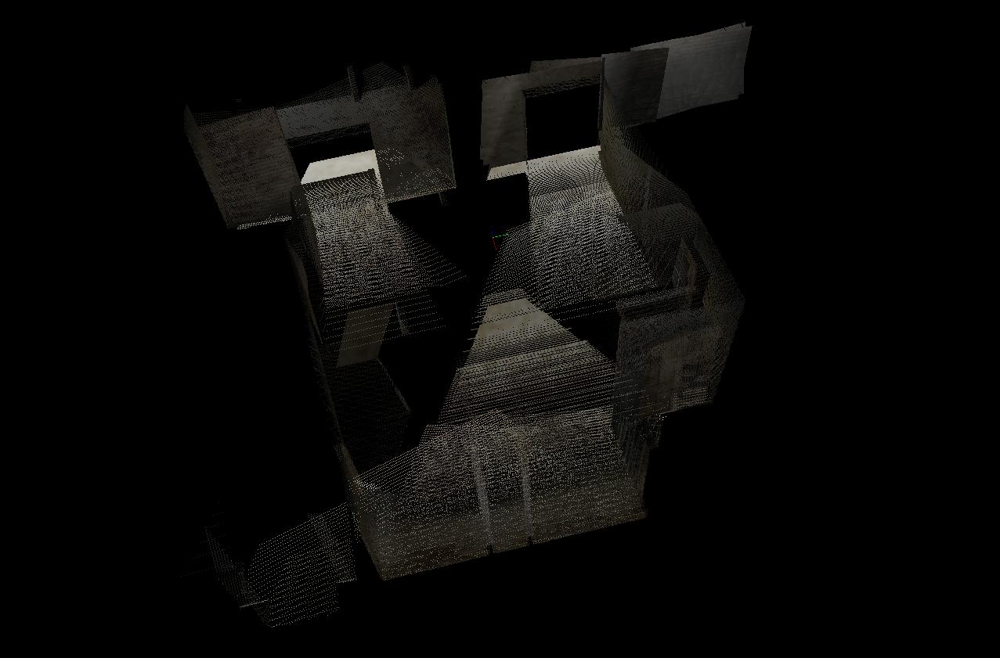

Zephyr
===============

Zephyr is a ROS based MAV simulator (particularly for the [AscTec Firefly](http://www.asctec.de/en/uav-uas-drone-products/asctec-firefly/)) that enables MAVs to do SLAM and 3D navigation only using on-board sensors in GPS-denied environments. This project is being written for the thesis of an Istanbul Technical University Astronautical Engineering student, Vatan Aksoy Tezer by himself. The code is currently heavily based on RotorS, a MAV simulator devloped by ETH Zurich. For more information about the simulator please refer to [RotorS github page](https://github.com/ethz-asl/rotors_simulator). The code of that part is licensed under the Apache License, Version 2.0.

The 3d mapping part of the code uses [rtabmap](http://wiki.ros.org/rtabmap_ros), which is licensed under the BSD 3-Clause "New" or "Revised" License and developed by Introlab.

The 2d mapping part of the code uses [gmapping](http://wiki.ros.org/gmapping), which is licensed under the CreativeCommons-by-nc-sa-2.0 License.

Gazebo worlds and extra sensors were taken from [hector_gazebo_worlds](https://github.com/tu-darmstadt-ros-pkg/hector_gazebo), developed by Flight Systems and Automatic Control group at TU Darmstadt. It is licensed under BSD License.

The other codes and additions are written by myself and licensed under MIT license.

Installation Instructions - Ubuntu 16.04 with ROS Kinetic
---------------------------------------------------------
 ```
 $ sudo apt-get install ros-kinetic-rtabmap-ros ros-kinetic-hector-mapping
 $ mkdir -p ~/catkin_ws/src
 $ cd ~/catkin_ws/src
 $ catkin_init_workspace  # initialize your catkin workspace
 $ git clone https://github.com/VatanTezer/zephyr.git # copy the code to your workspace
 $ cd ~/catkin_ws
 $ catkin build # Build the code
 $ echo "source ~/catkin_ws/devel/setup.bash" >> ~/.bashrc
 $ source ~/.bashrc
 ```

Basic Usage
-----------
  ```
  $ roslaunch zephyr_gazebo localization_scenario.launch
  $ roslaunch zephyr_mapping kinect_rtabmap.launch
  ```

After executing the commands, 2 seperate GUIs should show up. These are:
1. Gazebo: Gazebo is the physics integrated simulator, which the MAV goes accordingly. 
2. Rviz: The camera feed, maps and depth points are visualized in Rviz. 

MAV will automatically start navigating and mapping between pre-determined waypoints once the GUIs show up. These waypoints are located and can be changed from rotors_gazebo/resource/example_waypoints.txt file. For more information, please visit [RotorS github page](https://github.com/ethz-asl/rotors_simulator).



Viewing Generated 2D Map
---------------------
  ```
  $ rosrun map_server map_saver -f ~/catkin_ws/src/map
  ```
Example maps generated from this package can be found under test directory of this repository.



Viewing Generated 3D Map
---------------------
  ```
  $  rtabmap-databaseViewer ~/.ros/rtabmap.db
  ```
Example maps generated from this package can be found under test directory of this repository.



Future Work
-----------
 - Autonomous navigation without waypoints
 - Yaw-Only control mode, for better mapping
 - Obstacle Avoidance
 - CNN/DNN for object recognition, such as doors and windows to pass through
 - New low level controller for real world applications on different MAVs
 - Soft Landing/Disarm